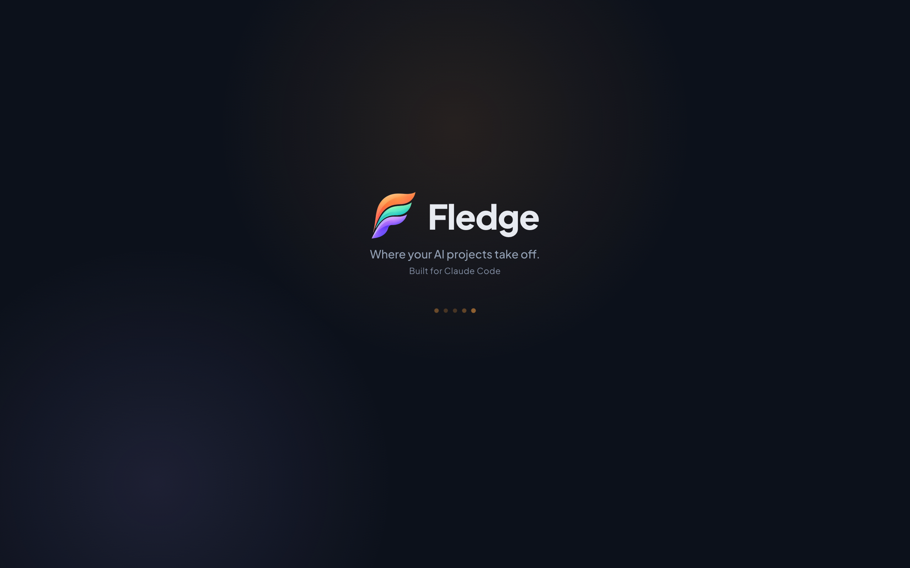
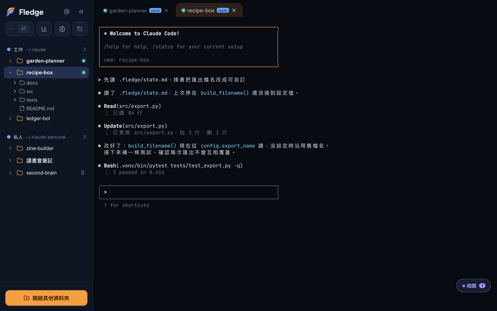
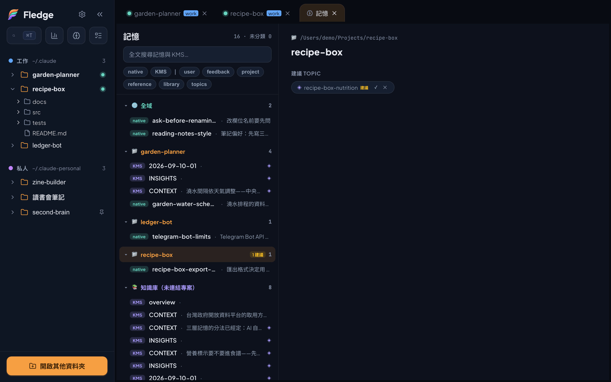
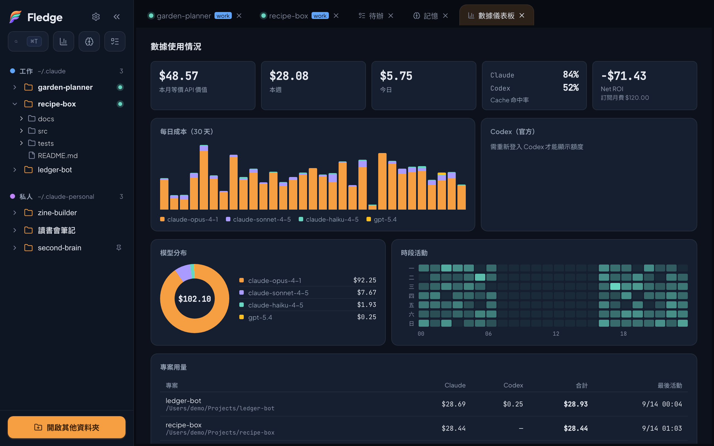
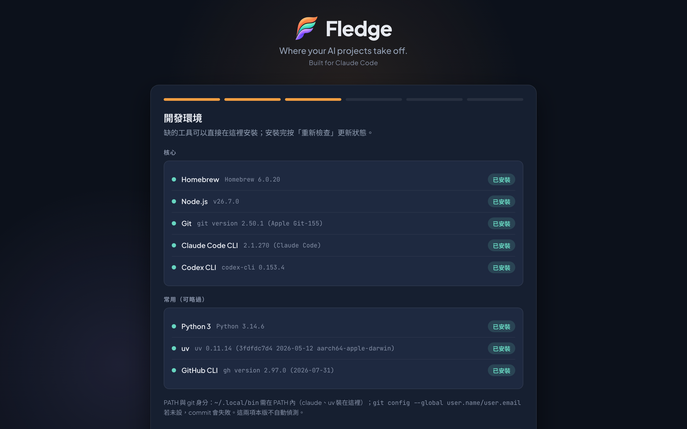

# Fledge — AI Workflow Studio

> **Where your AI projects take off.**
>
> <sub>Built for Claude Code.</sub>


**English** · [繁體中文](README.md)

Fledge is a development and project-management tool for vibe coders. The development half runs the real Claude Code on every project inside one window. The project-management half is not the kind that hands out work to a team — it is built for the **hand-off between a person and an AI**.

It organizes everything around "project × AI session": one click opens a real Claude Code session with the right account in the right folder. Before you start, you see where you left off and what is still open; decisions you make have a place to go; connections between projects have a place to be seen. No terminal ritual, no IDE sprawl — and no amnesia just because the interface is simple.

Under the hood it drives **the real Claude Code on your machine** — no rewrite, no proxy. Your existing skills, `CLAUDE.md`, MCP servers, and signed-in accounts carry over untouched. Fledge adds one layer of interface on the outside, plus three layers of memory.

<p align="center">
  
  
  <br><sub>Left: splash screen · Right: workspace — pick a project in the sidebar, switch sessions in the tabs, the terminal is the real Claude Code</sub>
</p>

## Install (macOS Apple Silicon)

**Requirements:** macOS on Apple Silicon (arm64), with the **Claude Code CLI (`claude`) installed and signed in**. Fledge launches the real Claude Code on your machine, so `claude` has to work in your terminal first — see the [Claude Code docs](https://docs.claude.com/en/docs/claude-code). (Not installed yet? The onboarding wizard's "Dev environment" step can install it in one click.)

### Terminal (recommended)

```bash
curl -fsSL https://raw.githubusercontent.com/dreamfind1021/fledge/main/scripts/install.sh | bash
```

Installs to `/Applications`; open it from Spotlight/Launchpad. (Use `bash`, not `sh` — the script relies on bash and `pipefail`.)

### .dmg (GUI)

Download `Fledge_*_aarch64.dmg` from [Releases](https://github.com/dreamfind1021/fledge/releases) and drag it into Applications.

> ⚠ **Not yet Apple-signed.** A `.dmg` downloaded via a browser may be blocked by Gatekeeper on first launch ("app is damaged"). Fix: **System Settings › Privacy & Security › Open Anyway**, or run:
> ```bash
> xattr -dr com.apple.quarantine /Applications/Fledge.app
> ```
> (The `curl` install script doesn't trigger this, since it doesn't set the quarantine flag.)

> ⚠ **If macOS says "Fledge was blocked from accessing Contacts/Calendar", don't worry.** Fledge doesn't have — and doesn't need — those permissions. Claude Code is a child process of Fledge, so when any program it launches (Chrome, say) casually probes Contacts, macOS charges it to Fledge and blocks it outright. Only that side query is blocked; the main job still completes.
>
> **The only permission you may need to grant by hand is "Full Disk Access"**, and only when Claude Code inside Fledge needs to read protected paths like `~/Library/…`. Grant it to **Fledge.app** (not `claude`). For now, the grant silently stops working after every update — toggle it off and on again. Full explanation and how to verify it yourself: [`guides/macos-permissions.en.md`](guides/macos-permissions.en.md).

<!-- After ticket 22 lands: change "toggle it off and on again after every update" to "grant it once", and delete this comment -->

## Quick start

The first-launch wizard walks you through:

1. **Pick a work root** — Fledge scans its first-level subfolders as projects and lists them in the sidebar. You can add several roots.
2. **Check the dev environment** — Homebrew, Node, Git, Claude Code, Codex: what's installed, what isn't; missing tools install in one click (except Homebrew, which needs sudo — the wizard gives you the command to paste).
3. **Sign in to accounts** — each account signs in separately. With more than one account there is an extra "shared setup" step that symlinks skills, settings, and plugins across accounts, so any skill you install later is installed once.
4. **Deploy a template** — pick a folder and drop in the project starter or the second-brain skeleton. Existing files are never overwritten.

After that it's everyday use: click a project on the left, switch tabs at the top, watch the pulsing dot on each tab to see which session is busy. Settings lets you change accounts, add roots, or run a backup at any time.

Have a backup bundle? Choose "I have a backup" on the welcome screen to take the other path: it brings back account settings, skills, and project-path mappings from the bundle. That is how you move to a new machine.

## Why this exists

Fledge started as a launcher. Once there were enough projects, the ritual before every work session — find the folder, open a terminal, type the command, remember which account — became its own kind of friction, and "one click opens a session" was the fix.

Everything it grew afterwards maps to a kind of forgetting. Switching projects and losing track of where you left off grew the resume note. "Things to deal with later" piling up in a hand-written `.md` grew the task panel. Research and ideation notes scattered across folders with nothing tying them together grew the second-brain structure and the memory panel. The launcher removes friction at the start; the other three remove friction when you come back — and in use they feel like short-term, mid-term, and long-term memory: the resume note, the tasks, the second brain. None of this was designed up front; it grew out of use.

The author is a vibe coder — someone who builds with AI, without a software-engineering background. Asking an engineer how they manage projects got the answer "the system our engineering team uses" — a system designed for dividing work among people, while what needed managing here was the hand-off between a person and an AI. Fledge is built for the latter.

## How it differs from other tools

| vs. | What Fledge does differently |
|---|---|
| A bare terminal | Adds a "project layer" — one click opens an AI session with the right account and folder, no more digging through folders, opening a terminal, typing commands, remembering accounts |
| An IDE | Minimal and AI-first — none of the engineering features you never use; light enough to open on a whim, and when you do, it's to work with AI |
| Traditional project-management tools | Those manage the division of work among people; Fledge manages the hand-off between you and an AI — where you stopped, what's next, where decisions go |

The approach is **a shell, not a rewrite**: Fledge doesn't reimplement Claude Code, it wraps it. When Claude Code updates, Fledge doesn't have to follow.

## Three layers of memory

The description above says "short-term, mid-term, long-term", because that's what it feels like in use. In the design, the layers differ not by duration but by **who decides what gets written, and how wide the scope is**:

| Layer | What it holds | Who writes it | Where it lives | Scope |
|---|---|---|---|---|
| **What the AI remembers on its own** | What the AI thinks is worth keeping: preferences, pitfalls, project facts | The AI decides | Claude Code's per-project memory, `CLAUDE.md` | One project |
| **What you ask the AI to remember** | Where you stopped, what's next | You ask, the AI writes | `.fledge/state.md`, `.fledge/tasks/` | One project; the panel shows all of them |
| **Your second brain** | Decisions, sources, connections between topics | You curate, Fledge links | An Obsidian vault, `~/.fledge/memory-links.json` | Across projects and accounts |

A common complaint about AI is "it doesn't remember what we were doing". With these three layers in place, that complaint mostly goes away — not because the model changed, but because every kind of thing worth remembering has a fixed place, and the AI can reach it when work starts: `CLAUDE.md` and its own memory load on every launch; the resume note and tasks live in the project, and "read `.fledge/state.md` first" as the opening line picks them up; the second brain is fed to it by a hook when it enters that vault. The memory is not in the model. It's in files.

### What the AI remembers on its own

Fledge doesn't touch this layer at all. Claude Code, Codex, and the other CLIs already have their own memory: `CLAUDE.md` is the rules you give it, per-project memory is the notes it writes for itself. That layer already exists and works well; there's no reason to redo it. What Fledge adds is one screen that lays out these notes for **every project and every account** (see the memory panel below), because the CLI can't see the whole picture by itself.

### What you ask the AI to remember

Two things, both under the project's `.fledge/`, neither in git:

- **The resume note** `.fledge/state.md` — when you wrap up, say "write the resume note" and the AI records where you're stuck, what's next, and what tripped you up. Next time, the task panel's overview pulls that "next step" line out and shows it beside the project.
- **Tasks** `.fledge/tasks/NN-title.md` — one file per item. Created from the panel or from a conversation, it's the same stack of files.

This layer needs two skills to connect to the AI (`resume-note` and `fledge-tasks`, both shipped in [`skills/`](skills/)). Without them the panel still works fully; the AI just doesn't know the format, so it can't open tasks or write notes.

### Your second brain

An Obsidian vault for decisions, sources, and the connections between topics. The structure is simple: `topics/` holds lines of thought (one folder per topic; `CONTEXT.md` records where it stands, session cards record each conversation), `library/` holds synthesized external knowledge (cited claim by claim). Topics link to each other with `[[wikilinks]]`, and frontmatter `tags` line up with project names. The vault is itself a project in the sidebar — open a session there to research or brainstorm, and the AI reads the whole context.

Fledge's **memory panel** puts this vault and the "AI's own" notes on one screen: full-text search, grouped by project, with the links between projects and topics. When you open a project, a "related topics" float appears at the bottom right of the terminal — half of those relations are already written into the vault's folder names and tags; Fledge just reads them out.

The vault skeleton ships with Fledge as a template the onboarding wizard can deploy. Details: [`guides/memory-and-second-brain.en.md`](guides/memory-and-second-brain.en.md).

### Where the line is

Fledge **does not remember things for the AI, and does not inject memory into sessions**. The three things that actually "remember" are the CLI's own memory, the `.fledge/` you ask it to write, and your second brain. Fledge's job is to give each a fixed place, one screen to see them, and the connections between them. Installing Fledge won't make the AI smarter — it will make it forget a lot less.

## Features

One paragraph per feature. Step-by-step details live in [`guides/`](guides/).

**Projects and sessions**

- **Project sidebar** — scans the projects under your roots, groups them by account with a color per account, so work and personal never blur. Expand a project's file tree in the sidebar and drag a file into the terminal to paste its path.
- **Multiple accounts** — each account maps to its own Claude config directory and quota. Every project remembers its default account, and you can also "open this one with a different account" on the spot.
- **The real Claude Code** — the embedded terminal (xterm.js + a PTY bridge) runs the actual Claude Code. Conversations, skills, MCP, permission prompts: identical to the terminal. The parts that tend to break in xterm — CJK input methods, copy/paste, the context menu — have all been fixed.
- **Tabs + activity indicator** — each "project × account" is a tab; run several at once. A pulsing dot on each tab shows in real time whether the AI is working or idle.

**Memory**

- **Task panel** — every project's open count and "next step" on one screen. Drill in to add, cycle, or delete tasks, or edit the body right in the panel (with drafts, so switching tabs loses nothing). → [`guides/tasks-and-resume-note.en.md`](guides/tasks-and-resume-note.en.md)
- **Memory panel** — aggregates Claude Code memory and the second brain across all accounts and projects; full-text search, grouped browsing; Fledge suggests cross-project links for you to confirm or dismiss. Opening a project floats its related topics at the bottom right of the terminal. Always read-only toward the sources. → [`guides/memory-and-second-brain.en.md`](guides/memory-and-second-brain.en.md)

<p align="center">
  
  
  <br><sub>Left: task panel · Right: memory panel</sub>
</p>

**Observability**

- **Dashboard** — estimates daily spend, model mix, per-project usage, and cache hit rate from Claude Code's and Codex's local logs, and nets it against your subscriptions. Codex's live quota comes straight from the official API. The pricing table is yours to update (`admin/sync_pricing.py`).

<p align="center">
  
  
  <br><sub>Left: dashboard · Right: onboarding wizard</sub>
</p>

**Environment and moving house**

- **Onboarding wizard** — environment detection, one-click installs, account sign-in, shared setup across accounts, template deployment. Anything left unfinished can be continued from Settings.
- **Backup / restore / migrate** — what gets backed up is your **Claude ecosystem** (every account's config directory, `~/.agents`), not Fledge itself. Login credential files are not collected (Claude's login lives in the Keychain and isn't reachable anyway; daemon keys are explicitly excluded), but settings, `.claude.json`, and conversation history are **copied as-is** — any key you pasted into a setting or a conversation goes into the bundle. Timestamped, never auto-deleted. Restore unpacks into a new directory with a diff report and leaves what's in use alone. Moving to a new machine takes the wizard's "I have a backup" path all the way through.

**Interface**

- **Bilingual UI** — switch the interface language; Traditional Chinese and English are both complete.
- **Nightfall dark theme** — restrained and AI-first. All contrast passes WCAG AA, color is never the only signal, everything is keyboard-operable.
- **Native and fast to launch** — a macOS `.app`; the backend uses an onedir layout (no re-extraction per launch); install via `curl` or `.dmg`.

## Bundled skills and templates

Fledge **does not install any of these automatically** — it never touches `~/.claude/settings.json`, `CLAUDE.md`, or `~/.claude/skills/`. Whether and what to install is up to you.

### Skills ([`skills/`](skills/))

| Skill | What it does | Without it |
|---|---|---|
| `fledge-tasks` | Lets Claude Code read and write `.fledge/tasks/` — "open a task", "what's on the list" | The panel still works; the AI just can't open tasks |
| `resume-note` | Writes `.fledge/state.md` when you wrap up — "write the resume note" | The panel's "next step" column stays empty |
| `handoff` | When context is running out and you need to continue in a fresh conversation: writes the full resume note and produces a paste-in prompt | No effect |

All three at once:

```bash
cp -R skills/fledge-tasks skills/resume-note skills/handoff ~/.claude/skills/
```

Or individually:

```bash
cp -R skills/fledge-tasks ~/.claude/skills/    # tasks
cp -R skills/resume-note  ~/.claude/skills/    # resume note
cp -R skills/handoff      ~/.claude/skills/    # conversation hand-off
```

`handoff` is tied to the author's own workflow (superpowers' spec → plan → task-by-task execution). Copying it verbatim may not fit yours; treat it as a reference. The skills themselves are written in Traditional Chinese.

### Templates (the wizard's "Deploy a template", or Settings)

| Template | Contents |
|---|---|
| Project starter | A generic `CLAUDE.md` plus a `docs/` folder — deliberately plain, meant to be edited |
| Second brain | A complete research/ideation vault: `CLAUDE.md` rules, templates for the `topics/` and `library/` zones, three auto-derived index files |

**The second-brain template ships with hooks**: its `.claude/settings.json` runs two Python scripts whenever Claude Code opens in that folder (`vault_dirty.py` tracks wrap-up state; `prompt_router.py` nudges the AI to read the appendix when you mention library operations). Both only write the vault's own `.vault-dirty.json` and marker files under `/tmp` — nothing else. Don't want them? Delete the `.claude/` folder; the vault works without it.

## What Fledge won't touch

The scariest thing about installing someone else's tool is what it might quietly change. This section spells out Fledge's boundaries:

- **It doesn't write your Claude Code settings.** `~/.claude/settings.json`, `CLAUDE.md`, `skills/` — none of them. Skills are copied by you. The wizard's "shared setup" is the one exception: it creates symlinks after you confirm, and lists exactly what it will create first.
- **The memory panel is read-only toward its sources.** Claude Code's memory directories and your vault are only ever read. The only file it writes is its own `~/.fledge/memory-links.json`.
- **Tasks and resume notes only write the project's `.fledge/`.** It doesn't edit `.gitignore` — whether `.fledge/` goes into version control is a line you add yourself.
- **Backups don't collect login credential files; restores never overwrite what's in use.** What's excluded is the Keychain/daemon-key kind of thing; settings and conversation history are copied as-is, so a key you pasted somewhere will be in the bundle. Restore unpacks into a new directory and gives you a diff report; whether to touch the live setup is your call.
- **Templates never overwrite.** If the destination already has a file of the same name, it's skipped.
- **Child processes don't get Fledge's token.** The sidecar's auth token is never passed into Claude Code's environment.

## How it works

Three layers, each with one job:

| Layer | Tech | Responsible for |
|---|---|---|
| **Shell** | Tauri 2.x (Rust) | `.app` install, the window, the backend's lifecycle (start/stop) |
| **Backend** | Python sidecar (FastAPI + ptyprocess) | scanning projects, bridging the PTY (which actually runs Claude Code), reading/writing settings, scanning memory and usage |
| **Frontend** | React + TypeScript (Vite) | the sidebar, tabs, and panels; xterm.js for the embedded terminal |

Data flow: **frontend ↔ backend (HTTP / WebSocket) ↔ PTY ↔ Claude Code CLI**. The Rust shell only brings the backend up and tears it down cleanly — including a graceful shutdown, so no orphaned Claude Code processes are left behind. Full module map and impact chain: [`PROJECT_MAP.md`](PROJECT_MAP.md).

## Development

```bash
# Python sidecar environment
cd sidecar && python3 -m venv .venv && source .venv/bin/activate && pip install -e ".[dev]"
pytest                       # sidecar tests

# Frontend + Tauri (make sure cargo is on PATH first)
. "$HOME/.cargo/env"
npm install
npm test                     # frontend unit tests (vitest)
npm run tauri dev            # launch the app in dev mode
```

For packaging into `.app`/`.dmg`, see [`scripts/`](scripts/); CI is in [`.github/workflows/release.yml`](.github/workflows/release.yml).

## Status & roadmap

**Available now (macOS Apple Silicon, verified on real hardware):** everything in the feature list above.

**Planned:**

- **A stable signing identity** — so Full Disk Access doesn't silently expire on every update.
- **Apple signing + notarization** — currently unsigned.
- **Light theme** — the token layer is ready; the light palette hasn't passed visual review.
- **Task panel** — a persistent project tree on wide screens so you don't have to go back to the overview to switch projects; a "parked" status; a copyable "paste into a new conversation" block from the resume note.
- **Pricing gaps in the dashboard** — long-context tiers and fast-mode pricing aren't counted yet, so costs are underestimated.
- **Re-check the backup list** — confirm every item under `~/.claude` that should be included is.
- **In-app skill install** — designed; waiting on a safe write mechanism.
- Other platforms (Windows/Linux), in-app auto-update.

**Known issues (open tickets, not yet fixed):**

- If closing a session fails, the UI treats it as closed and the leftover Claude Code process is lost track of.
- If the config file fails to load, the welcome screen wrongly says "config created".
- When re-running onboarding, a failed project count shows 0, indistinguishable from "no projects".
- The "Reveal in Finder" capability has no path scope — wider than it needs to be.

## License

[MIT](LICENSE)
