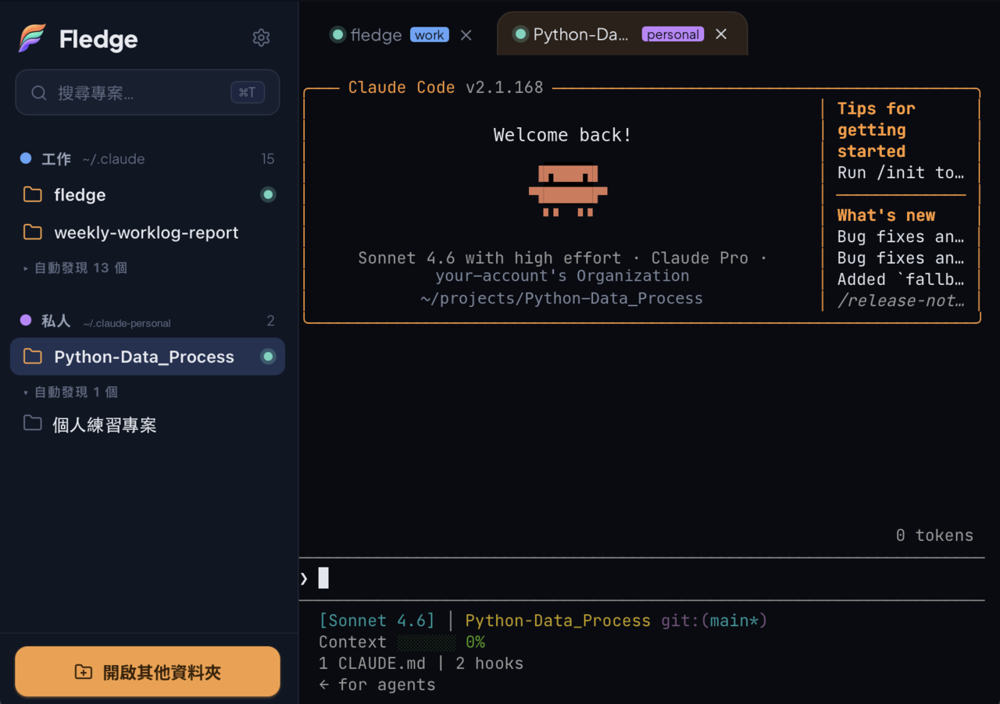

# Fledge — AI Workflow Studio

> **Where your AI projects take off.**
> Run AI on your projects — without the terminal or the IDE.
>
> <sub>Built for Claude Code.</sub>


[English](README.en.md) · **繁體中文**

Fledge 是一個 **AI 工作流工作室（AI Workflow Studio）**——以「**專案 + AI session**」為組織單位，讓你不用碰終端機的繁瑣（翻資料夾、右鍵開終端機、敲指令、記帳號），也不用面對 IDE 介面的複雜，就能對每個專案啟動 AI、推進工作。

底層跑的是**你本機真實的 Claude Code CLI**：不重做、不代理，直接驅動 `claude`，所以你原有的 skills、`CLAUDE.md`、MCP、登入帳號全部原封不動繼承過來。Fledge 只在外層補上一層「專案管理 + 多帳號 + 多分頁」的友善介面。

<p align="center">
  
</p>

## 為什麼做這個

我不是資訊工程出身，是靠 AI 寫程式的 vibe coder。一開始一兩個專案還好，但專案一個一個多起來之後，每次要開工都是同一套儀式：先在 Finder 裡翻到對的專案資料夾、在它上面右鍵開啟終端機、再敲指令把 `claude` 叫起來，過程中還得想起這個專案該用哪個帳號。光是這些前置，就磨掉了不少動手的興致。

Fledge 是我為自己打造的一個舒適工作環境：把「開哪個專案、用哪個帳號、起一個 AI session」這些雜事收斂成點一下，剩下的心力留給真正想做的事。

## 定位

| 對照 | Fledge 贏在哪 |
|---|---|
| 裸終端機 | 補上「專案管理層」——點一下就用對的帳號／目錄開好 AI session，不必每次翻資料夾、右鍵開終端機、敲指令 |
| IDE | 極簡、AI 為中心——砍掉一般 IDE 那些用不到的工程功能，輕到不害怕，開了就是要跟 AI 工作 |

技術路線是**套殼不重做**：不重新實作 Claude Code，只在外層加一層介面——`claude` 自己升級時，Fledge 不必跟著改。

## 安裝（macOS Apple Silicon）

**前置需求：** macOS、Apple Silicon（arm64），並且**已安裝、登入好 Claude Code CLI（`claude`）**。Fledge 啟動的是你本機真實的 `claude`，所以它必須先能在終端機跑起來；安裝見 [Claude Code 官方文件](https://docs.claude.com/en/docs/claude-code)。

### 終端機（推薦）

```bash
curl -fsSL https://raw.githubusercontent.com/dreamfind1021/fledge/main/scripts/install.sh | bash
```

裝進 `/Applications`，從 Spotlight／Launchpad 開即可。（請用 `bash` 而非 `sh`——腳本依賴 bash 與 `pipefail`。）

### .dmg（GUI）

到 [Releases](https://github.com/dreamfind1021/fledge/releases) 下載 `Fledge_*_aarch64.dmg`，拖進 Applications。

> ⚠ 目前**未經 Apple 簽章**。從瀏覽器下載的 `.dmg` 首次開啟可能被 Gatekeeper 擋（「App 已損毀」）。解法：到 **系統設定 › 隱私與安全性 › 仍要打開**，或執行：
> ```bash
> xattr -dr com.apple.quarantine /Applications/Fledge.app
> ```
> （終端機 `curl` 安裝腳本不會觸發此問題，因為它不打 quarantine 標記。）

## 快速上手

首次啟動會帶你走三步：

1. **設定帳號**——指向你的 Claude 設定目錄（如 `~/.claude`）；需要的話可再加其他帳號，各自指向不同的設定目錄。
2. **選專案資料夾**——Fledge 掃描底下的專案、列進側欄。
3. **點任一專案**——在新分頁開一個真實的 `claude` session，直接開始對話。

之後就是日常：左邊點專案、上面切分頁，看分頁上的呼吸燈就知道哪個 session 正在忙。

## 特色功能

Fledge 把日常用 AI 工作會遇到的瑣事都收進介面裡：

- **專案為中心**——自動掃描你指定資料夾底下的專案、整理進側欄，也能隨時手動「開啟其他資料夾」。
- **工作／私人分得乾淨**——把工作專案和私人專案用帳號切開，側欄依帳號分組、各以顏色標示，一眼分得清、公私不會混到一起。
- **多帳號、切換自如**——可以建多個帳號，每個對應自己的 Claude 設定目錄與額度；每個專案記住它的預設帳號，也能臨時「這次改用別的帳號開」，不必動到設定。
- **GUI 內跑真實 Claude Code**——嵌入式終端機（xterm.js + PTY 橋接）跑的是真正的 `claude`，不是模擬；對話、skills、MCP、權限提示，全都和你在終端機裡看到的一模一樣。
- **多分頁 sessions + 活動指示**——每個「專案 × 帳號」開成一個分頁，可同時跑多個 session；分頁上的呼吸燈即時顯示 AI 正在忙（working）還是閒置（idle）。
- **跨專案待辦面板**——每個專案的待辦記在它自己的 `.fledge/tasks/` 底下；面板把所有專案的未完成條數與「下一步」放在同一個畫面，點進去可以建票、切狀態、刪票、用編輯器打開。附一支 skill（見 [`skills/`](skills/)），讓 Claude Code 也能讀寫同一份檔案。
- **極簡深色介面**——Nightfall 品牌主題，視覺克制、以 AI 為中心。
- **桌面原生、啟動快**——打包成 macOS `.app`，後端採 onedir 免每次解壓、冷啟動快；終端機指令或 `.dmg` 兩種安裝方式任選。

## 運作方式

Fledge 是三層架構，各司其職：

| 層 | 技術 | 負責 |
|---|---|---|
| **殼** | Tauri 2.x（Rust） | `.app` 安裝、視窗、啟動／關閉後端的生命週期 |
| **後端** | Python sidecar（FastAPI + ptyprocess） | 掃描專案、橋接 PTY（實際跑 `claude`）、讀寫設定（`~/.fledge/config.json`） |
| **前端** | React + TypeScript（Vite） | 側欄／分頁／設定 UI；xterm.js 嵌入終端機 |

資料流是：**前端 ↔ 後端（HTTP / WebSocket）↔ PTY ↔ `claude` CLI**。Rust 殼只負責把後端拉起來、收好——包含優雅關閉，避免你關掉視窗後還留下孤兒 `claude` 進程。完整模組地圖與影響鏈見 [`PROJECT_MAP.md`](PROJECT_MAP.md)。

## 開發

```bash
# Python sidecar 環境
cd sidecar && python3 -m venv .venv && source .venv/bin/activate && pip install -e ".[dev]"
pytest                       # sidecar 測試

# 前端 + Tauri（先確保 cargo 在 PATH）
. "$HOME/.cargo/env"
npm install
npm test                     # 前端單元測試（vitest）
npm run tauri dev            # 開發模式啟動 App
```

打包成 `.app`／`.dmg` 的流程見 [`scripts/`](scripts/)（`build_binary.sh` 打包後端、`bump-version.sh` 統一版號），CI 設定見 [`.github/workflows/release.yml`](.github/workflows/release.yml)。

## 狀態與藍圖

**目前可用（macOS Apple Silicon，已真機驗證）：** 專案掃描與管理、多帳號分隔、在 GUI 視窗內啟動並操作真實的 Claude Code session、多分頁與分頁活動指示、Nightfall 深色品牌主題與品牌圖示，以及 `curl` 與 `.dmg` 兩種桌面安裝方式。

**規劃中／未來方向：**

- 支援 Codex（目前以 Claude Code 為主，未來把其他 AI CLI 也納進來）
- 介面深／淺雙模式（token 層已預留，淺色待補）
- Apple 簽章 + notarization（目前未簽章）
- 其他平台（Windows／Linux）
- in-app 自動更新

## 授權

[MIT](LICENSE)
