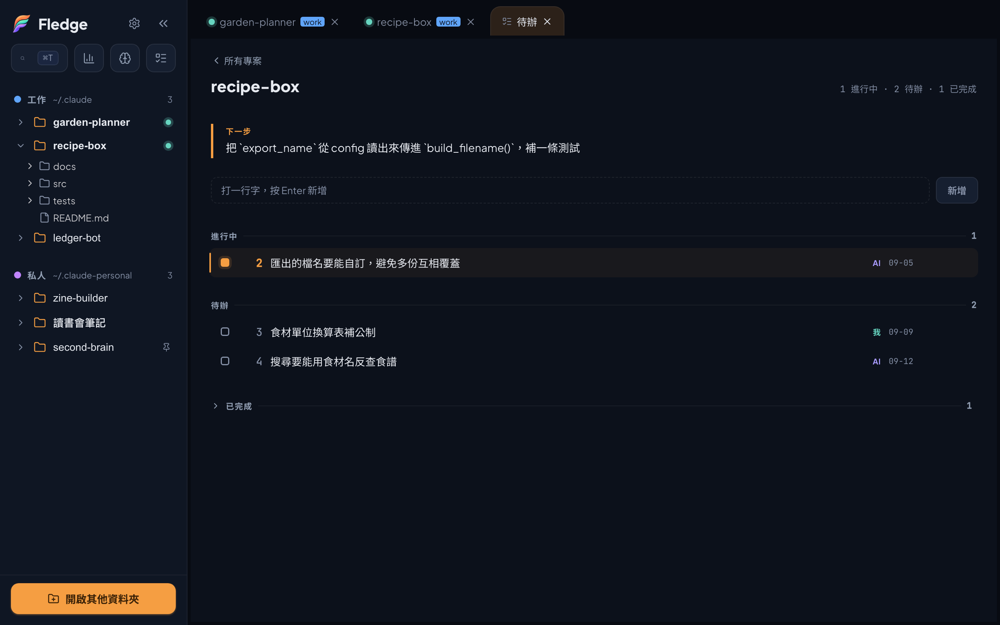

# Tasks, the resume note, and two skills

**English** · [繁體中文](tasks-and-resume-note.md)

> This guide covers the "what you ask the AI to remember" layer and how its pieces connect: the task panel, the resume note, `fledge-tasks`, and `resume-note`.
> By the end you'll know the file formats, how it works day to day, and what Fledge deliberately doesn't do.



## Three parts

| Part | Where it lives | What it does |
|---|---|---|
| Task panel | Fledge's "Tasks" tab | Reads and writes each project's `.fledge/tasks/*.md`; reads the first 20 lines of `.fledge/state.md` to pull out the "next step" |
| `fledge-tasks` skill | `~/.claude/skills/fledge-tasks/` | Lets Claude Code read and write the same stack of task files |
| `resume-note` skill | `~/.claude/skills/resume-note/` | Lets Claude Code write `.fledge/state.md` when you wrap up |

The panel is fully usable without the skills — add, change status, delete, edit in place, open in an external editor, nothing missing. The only difference is the AI side: without the skills Claude doesn't know the format, so it can't open tasks or write the resume note, and the "next step" column stays empty.

## File formats

### A task: `.fledge/tasks/NN-short-name.md`

One file per item. No database, no index file — the panel and the AI both read and write the markdown directly.

```markdown
---
status: todo
source: me
created: 2026-09-13
---

# Export filename should be configurable

It's hard-coded right now; a second export overwrites the first.
```

| Where | Field | Value |
|---|---|---|
| Filename prefix `NN` | Number | Sequential from `01`; the **single source of truth**, never written into frontmatter |
| frontmatter | `status` | `todo` / `doing` / `done` |
| frontmatter | `source` | `me` (created from the panel) or `ai` (opened by Claude) |
| frontmatter | `created` | `YYYY-MM-DD` |
| First `# ` line | Title | One line |
| After that | Body | Free text, optional |

Field names and values are always English — that's the format contract between the panel and the skill. Title and body can be in any language.

**Numbers can collide.** The panel and the AI each assign numbers ("highest + 1"), so creating tasks from both at the same time can produce the same number. When that happens the panel shows both, flags both as abnormal, and you rename one file by hand. This is a deliberate choice not to add locking: a coordination mechanism for a rare case isn't worth it.

### The resume note: `.fledge/state.md`

Overwritten, not appended — it records "where things stand now", not history. History is git log's job.

The short form (most wrap-ups):

```markdown
# project-name — current state

> Updated: 2026-09-13

**Stuck on**: `build_filename()` in `routes/export.py` isn't wired to the setting yet

**Next**: read `export_name` from config, pass it into `build_filename()`, add one test

**Gotcha**: run tests with `.venv/bin/pytest`; the system python has no pytest
```

The full form (a phase is done and the next hasn't started) adds five sections: what to load, state to confirm, the full procedure, working conventions, things a fresh session must know. The skill has the template.

**The `**Next**:` label is the contract with the panel.** The panel reads only the first 20 lines of the file and recognizes only this label (`**下一步**：` works too, regardless of UI language). If the label isn't in the first 20 lines, the overview column is empty.

## How it works in practice

1. **Start of the day**: open the Tasks tab. The overview lists every project's open count and its "next step" — the line the AI wrote when you last wrapped up.
2. **Drill into a project**: see its tasks. Edit the body right in the panel (a small markdown subset, with drafts, so switching tabs loses nothing), or hit "open in editor" to use your own.
3. **Open a session and work**: click the project in the sidebar. When something comes up that needs handling later, tell Claude "**open a task** for this". It writes a file in the format above; switch back to the panel and it's there.
4. **Ask for status**: "**what's on the list**", "**what's still open**" — Claude reads only frontmatter and titles, never dumping every task's body into context.
5. **Wrap up**: "**write the resume note**". Claude writes one based on what the session did; nothing for you to type.

### Saying "remember this" goes to the memory system instead

Claude Code's built-in memory system also responds to "remember this", and it has higher priority than a skill. Say just "remember this" and the memory system usually takes it — `fledge-tasks` never even loads. The line is:

| What you want to keep | Say | Where it goes |
|---|---|---|
| Something this project needs done later | "open a task", "add it to the list" | `.fledge/tasks/` |
| A preference, a correction to how it works, a cross-project fact | "remember this" | Claude Code's own memory |

This was hit for real during packaging acceptance, not guessed.

## Installing the skills

```bash
cp -R skills/fledge-tasks skills/resume-note ~/.claude/skills/
```

With multiple accounts (multiple config directories), point the other accounts' `skills/` at the same directory so any skill is installed once:

```bash
ln -s ~/.claude/skills ~/.claude-other/skills
```

The onboarding wizard's "shared setup" step does exactly this (plus settings and plugins) — if you went through the wizard, there's nothing to do by hand.

## What it deliberately doesn't do

- **It doesn't decide what's worth keeping.** The AI never opens a task on its own — if you didn't ask, it doesn't. Deciding "this is worth recording" is a person's job.
- **It doesn't delete tasks.** Done means `status: done`; the file stays. Analysis that vanishes the moment it's finished is exactly what this is meant to prevent.
- **It doesn't edit `.gitignore`.** `.fledge/` is local working state and usually shouldn't be versioned. To exclude it, add a `.fledge/` line yourself.
- **It doesn't back up `.fledge/`.** The backup feature collects the Claude ecosystem (account config directories, `~/.agents`), not each project's `.fledge/`. Change machines or delete it by mistake and it's gone. Known trade-off.
- **It doesn't install skills for you from the app.** Copy them yourself.

## Appendix: `handoff`

`resume-note` is for wrapping up; `handoff` is for "context is running out, continue in a new conversation". It calls `resume-note` for the full form, then records a test baseline, checks branch state, lists memory candidates, and finally gives you three sentences to paste into the new conversation.

It's tied to the author's own workflow (spec → plan → task-by-task execution, a ledger for progress, Codex adversarial review) and may not fit yours verbatim. It ships in `skills/handoff/` as a reference.
