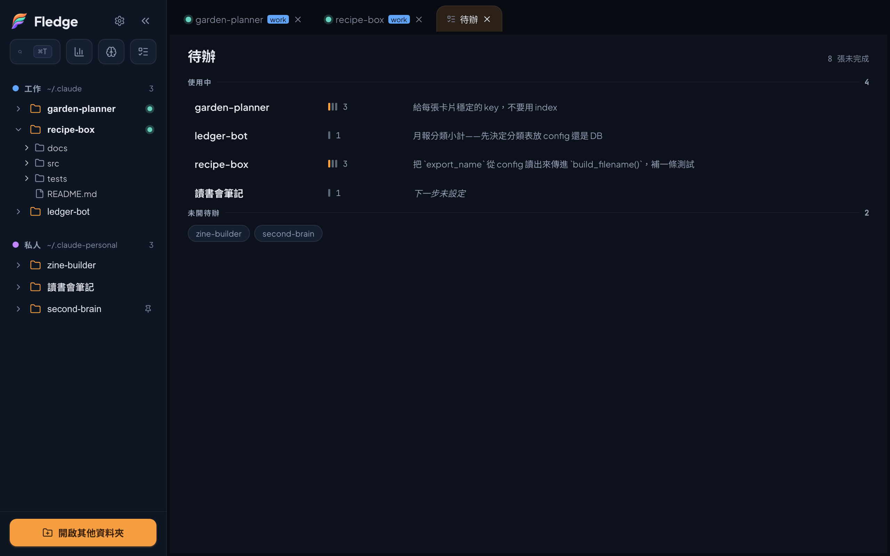

# 待辦、離場筆記，與兩支 skill

[English](tasks-and-resume-note.en.md) · **繁體中文**

> 這一篇講「你叫 AI 記的」那一層怎麼串起來：待辦面板、離場筆記、`fledge-tasks`、`resume-note`。
> 讀完會知道檔案格式、實際怎麼用、哪些事 Fledge 刻意不做。



## 三個部分

| 部分 | 住在哪 | 做什麼 |
|---|---|---|
| 待辦面板 | Fledge 的「待辦」分頁 | 讀寫每個專案的 `.fledge/tasks/*.md`；讀 `.fledge/state.md` 前 20 行抽「下一步」 |
| `fledge-tasks` skill | `~/.claude/skills/fledge-tasks/` | 讓 Claude Code 讀寫同一疊票檔 |
| `resume-note` skill | `~/.claude/skills/resume-note/` | 讓 Claude Code 在收工時寫 `.fledge/state.md` |

面板不裝 skill 也完整可用——建票、改狀態、刪票、面板內編輯、用外部編輯器打開，一項不少。差別只在 AI 那條線：沒有 skill，Claude 不知道檔案格式，開不了票、也寫不了離場筆記，「下一步」那一欄會一直是空的。

## 檔案格式

### 票：`.fledge/tasks/NN-短名.md`

一件事一個檔案。沒有資料庫、沒有索引檔——面板和 AI 都直接讀寫 markdown。

```markdown
---
status: todo
source: me
created: 2026-09-13
---

# 匯出的檔名要能自訂

目前寫死檔名，多份會互相蓋掉。
```

| 位置 | 欄位 | 值 |
|---|---|---|
| 檔名前綴 `NN` | 編號 | `01` 起的流水號，**唯一真相源**，不寫進 frontmatter |
| frontmatter | `status` | `todo` / `doing` / `done` / `parked`（擱置：「之後再說」，不算未完成，面板上摺疊在待辦下面） |
| frontmatter | `source` | `me`（從面板建的）或 `ai`（Claude 開的） |
| frontmatter | `created` | `YYYY-MM-DD` |
| 第一個 `# ` 行 | 標題 | 一行 |
| 其後 | 內文 | 自由，可省略 |

欄位名與值一律英文，這是面板與 skill 之間的格式合約；標題和內文不限。

**編號可能撞。** 面板和 AI 各自配號（都是「最大號＋1」），兩邊同時建票就可能拿到同一個編號。撞了面板會把兩張都顯示、都標成異常，手動改其中一個檔名就好。這是刻意不做鎖的取捨：為一個很少發生的情況加一層協調機制，不值得。

### 離場筆記：`.fledge/state.md`

覆蓋式，不是追加——它記的是「現在停在哪」，不是歷史。歷史交給 git log。

精簡版（絕大多數收工）：

```markdown
# 專案名 — 目前狀態

> 更新：2026-09-13

**卡在**：`routes/export.py` 的 `build_filename()` 還沒接到設定值

**下一步**：把 `export_name` 從 config 讀出來傳進 `build_filename()`，補一條測試

**坑**：測試要用 `.venv/bin/pytest`，系統 python 沒有 pytest
```

完整版（一個階段做完、下一階段還沒開始）多五個小節：載入什麼、確認狀態、完整流程、工作慣例、新 session 要記得的事。skill 裡有格式。

**`**下一步**：` 這個標籤是與面板的合約。** 面板只讀檔案前 20 行、只認這個標籤（`**Next**:` 也認，中英不分）。標籤不在前 20 行，總覽那欄就空著。

## 實際怎麼用

1. **開工**：打開待辦分頁——左邊專案樹、中間票清單、右邊票內容；點『下一步』右邊顯示整份離場筆記，那是上次收工時 AI 寫的；離場筆記在右邊可以直接改、按儲存。
2. **點專案**：中間換成這個專案的票清單，點一張票右邊顯示內容。要改內文直接在右邊編（支援 markdown 小子集、有草稿、切頁不丟字）；要用自己的編輯器就按「用編輯器打開」。
3. **開 session 工作**：側欄點專案。工作中冒出「這個之後要處理」，跟 Claude 說「**開一張票**記這個」。它照上面的格式寫一個檔，切回面板就看得到。
4. **問進度**：「**待辦有哪些**」「**還有什麼沒做**」——Claude 只讀 frontmatter 和標題，不會把每張票全文灌進 context。
5. **收工**：「**寫離場筆記**」。Claude 根據這個 session 做過什麼寫一版，不用人動手。

### 說「記一下」會被記憶系統接走

Claude Code 內建的記憶系統也吃「記一下」這句話，而且它的優先權比 skill 高。光說「記一下」，多半會被記憶系統接走，`fledge-tasks` 連載入都不會發生。分界是：

| 想存的 | 說法 | 去哪 |
|---|---|---|
| 這個專案之後要做的事 | 「開一張票」「加到待辦」 | `.fledge/tasks/` |
| 偏好、工作方式的指正、跨專案的事實 | 「記一下」 | Claude Code 自己的 memory |

這是打包驗收時實際遇到的，不是猜的。

## 安裝 skill

```bash
cp -R skills/fledge-tasks skills/resume-note ~/.claude/skills/
```

多帳號（多個設定目錄）的話，讓其他帳號的 `skills/` 指向同一個目錄，之後裝任何 skill 都只要裝一次：

```bash
ln -s ~/.claude/skills ~/.claude-other/skills
```

引導精靈的「共通設置」那一步做的就是這件事（外加 settings、plugins），走過精靈就不用手動做。

## 刻意不做的事

- **不判斷值不值得記。** AI 不會自己開票——沒開口它就不開。判斷「這件事值得記」的是人。
- **不刪票。** 做完就是 `status: done`，檔案留著。做過的分析做完就消失，正是這套東西要避免的。
- **不改 `.gitignore`。** `.fledge/` 是本機工作狀態，通常不該進版控。要排除自己加一行 `.fledge/`。
- **不備份 `.fledge/`。** 備份功能收的是 Claude 生態（帳號設定目錄、`~/.agents`），不含各專案的 `.fledge/`。換機器、誤刪都救不回。已知取捨。
- **不在 app 裡替你裝 skill。** 要自己複製。

## 附：`handoff`

`resume-note` 是收工用的；`handoff` 是「上下文快滿、要換一個新對話繼續」用的。它會呼叫 `resume-note` 寫完整版，再跑一次測試記數字、查分支狀態、列記憶候選，最後給三句話貼進新對話。

它綁作者自己的開發流程（spec → plan → 逐 task 執行、ledger 記進度、Codex 對抗式審查），照抄不一定合用。附在 `skills/handoff/`，當參考。
